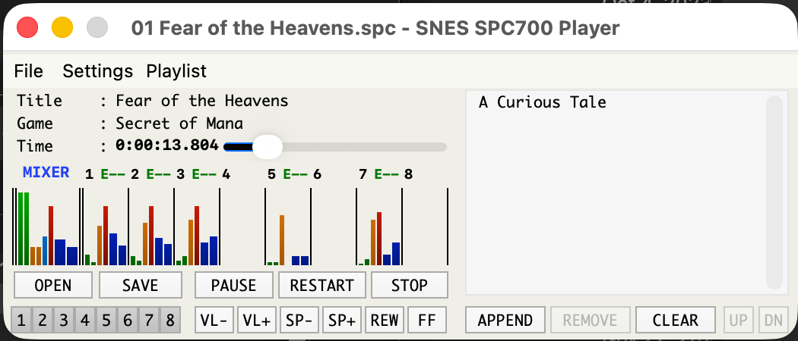

# SNES SPC700 Player + Improved SNESAPU.DLL

This fork carries an unofficial macOS port of SPCplay/SNESAPU alongside the
original Windows source. The original project is maintained by degrade-factory at
https://github.com/dgrfactory/spcplay.



The macOS port currently includes:

* A native AppKit SPCplay-style UI in `tools/spcplay_macos.mm`
* Universal macOS app build scripts in `scripts/`
* An Intel Mac `x86_64` backend built from the original SNESAPU assembly ported
  to Mach-O 64-bit
* A native Apple Silicon `arm64` SNESAPU backend in `snesapu.arm64/`
* Finder/open-with, drag-and-drop, live playback, playlist controls, metering,
  settings menus, and WAV export support

Build native or universal macOS app bundles with:

```sh
./scripts/build-spcplay-macos-app.sh x86_64
./scripts/build-spcplay-macos-app.sh arm64
./scripts/build-spcplay-macos-app.sh universal
```

The `x86_64` slice targets macOS 10.9 and later, preserving the faithful
SNESAPU assembly core for Intel Macs. The `arm64` slice targets macOS 11.0 and
later with a native Apple Silicon backend that has been checked against the
Intel path for byte-for-byte WAV output parity across the current regression
corpus. The `universal` build combines both slices into one `.app` bundle.

See `PORTING_MACOS.md` and `ARM64_PORTING_PLAN.md` for porting notes and
validation history.

### macOS release builds

The repository includes a GitHub Actions workflow at
`.github/workflows/macos-build.yml`. Every run builds
`spcplay-macos.app` as a universal Intel/Apple Silicon app bundle and uploads a
`spcplay-macos-universal.zip` artifact.

To publish a binary in GitHub Releases, push a version tag:

```sh
git tag v2.20.0-macos.1
git push origin v2.20.0-macos.1
```

The tagged workflow attaches `spcplay-macos-universal.zip` and its SHA-256 file
to the GitHub Release. Current CI builds are ad-hoc signed, not notarized, so
macOS Gatekeeper may require manual approval the first time the app is opened.

<!-- 2.20.0 -->


The **"SNES SPC700 Player"** is a very simple SPC player for Windows based on SNESAPU.  
For more information about this software, please see the [wiki page](https://github.com/dgrfactory/spcplay/wiki).

## Download builds

* Latest stable release: [release page (latest)](https://github.com/dgrfactory/spcplay/releases/latest)
* All releases (with BETA): [release page](https://github.com/dgrfactory/spcplay/releases)

## Links

* Official website: https://dgrfactory.jp/spcplay
* Official repository: https://github.com/dgrfactory/spcplay

## License

GNU General Public License v2.0
